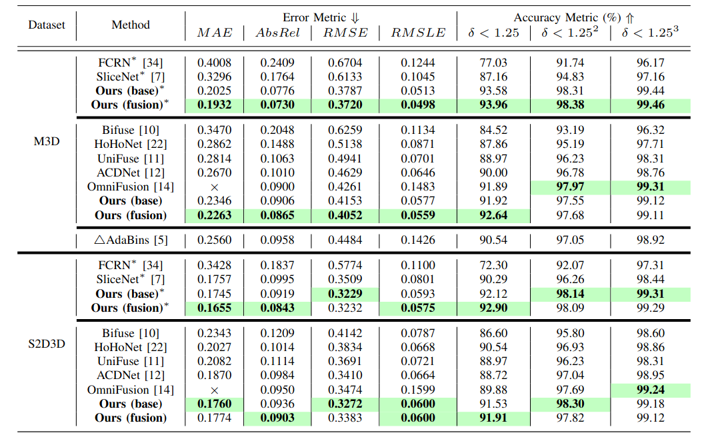
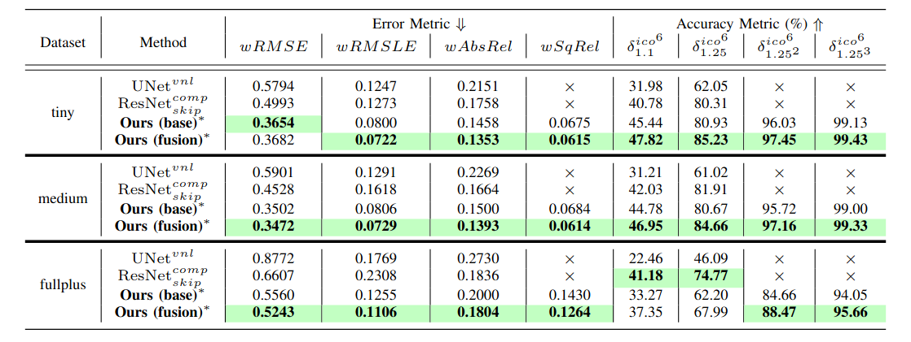

# S2Net: Accurate Panorama Depth Estimation on Spherical Surface

This repository contains:
* A pytorch implementation of paper S2Net: Accurate Panorama Depth Estimation on Spherical Surface in [arxiv](https://arxiv.org/abs/2301.05845).
* Dockerfile and scripts for evaluation on [Matterport3D](https://niessner.github.io/Matterport/) dataset.

This repository is licensed under MIT.

We use some codes from [Pano3D](https://vcl3d.github.io/Pano3D/) project which is also licensed under MIT.

## Requirements

We recommend you to use dockerfile provided in docker folder which uses CUDA 10.2 and pytorch 1.8.2 and tested on Tesla V100 32G.
For users who want to use newer versions of CUDA or using new nvidia GPU such as RTX3090, 
we recommend you to use dockerfile in docker/cuda11 folder, which uses CUDA 11.1.
We provide exampled docker script in run_docker.sh.

For users prefer configuration step by step, we recommend the following steps on Debian-like distributions:

* Install conda and setup conda env. Currently, the code is tested on python3.7:
```
conda create --name s2net python=3.7 
conda activate s2net
```
* Install torch, we use pytorch 1.8.2 and cuda 10.2 as an example:
```
conda install pytorch torchvision torchaudio cudatoolkit=10.2 -c pytorch-lts
```
* Install some extra dependencies using apt-get, most of them may have probably been already installed:
```
sudo apt-get install build-essential curl git \
vim wget zip \
bzip2 cmake \
libopenexr-dev \
libeigen3-dev \
apt-utils \
zlib1g-dev \
libncurses5-dev \
libgdbm-dev \
libnss3-dev \
libssl-dev \
libreadline-dev \
libffi-dev \
graphviz
```
* Install [nvidia apex](https://github.com/NVIDIA/apex), we recommend following official installation steps.
* Install extra python dependencies.
```
pip3 install scipy Pillow tensorboardX tqdm matplotlib pyquaternion pyrender opencv-python timm einops visdom plyfile openexr pytest
pip3 install attrdict tensorboard open3d numba pyyaml attrdict termcolor scikit-image healpy yacs h5py
```
* Install [MappedConvolutions](https://github.com/meder411/MappedConvolutions). 
```
git clone https://github.com/meder411/MappedConvolutions.git 
cd MappedConvolutions 
cd package 
python setup.py install
```


### FAQ

* Key update failure for nvidia-docker (errors are possibly like "NO_PUBKEY A4B469963BF863CC"): please refer to [this blog](https://developer.nvidia.com/blog/updating-the-cuda-linux-gpg-repository-key/).

## Usage

Before training and testing please first set OMP_NUM_THREADS, we recommend 8:

```
export OMP_NUM_THREADS=8
```


### Training 

For training on Matterport3d dataset using multiple **Tesla V100 32G cards** (we take 2 cards as an example) on pytorch 1.8.2:
```
python3 -m torch.distributed.launch --nproc_per_node=2 --nnodes=1 --node_rank 0 run_sp_monodepth_train.py \
-d /path/to/Matterport3D \
-i /path/to/Matterport3D/matterport3d_train_file_list.txt \
-v /path/to/Matterport3D/eval_file_list.txt \
-o /path/to/output_folder \
-c /path/to/config/train_cfg_2cards.yaml \
-p /path/to/swin_backbone/swin_base_patch4_window7_224_22k.pth
```
We've tested the code on a maximum of 4 Tesla V100 32G cards. 
The exampled config file is provided in config folder.
Note that learning rate and batch size in config file needs to be modified based on your specific hardware environments.

The [Swin backbone](https://github.com/microsoft/Swin-Transformer) can be pre-downloaded [here](https://github.com/SwinTransformer/storage/releases/download/v1.0.0/swin_base_patch4_window7_224_22k.pth).

### Testing

For testing please use:
```
CUDA_VISIBLE_DEVICES=0 python3 run_sp_monodepth_infer_eval.py --eval_depth_map \
-d /path/to/Matterport3D \
-i /path/to/Matterport3D/matterport3d_test_file_list.txt \
-o /path/to/where_your_want_to_place_test_results/ \
-c /path/to/config/test.yaml \
-m /path/to/models/trained_checkpoint.pth
```
Note that testing can only be done on a single card (we've tested the code on single Tesla V100 32G and Tesla P100 16G), and batch_size must be set to 1.

### Results

### FAQ

* Versions higher than pytorch 1.8.2: 
we use **torch.distributed.launch** for multi-card training but this has been substituted to [**torch.distributed.run**](https://pytorch.org/docs/stable/elastic/run.html) or [**torchrun**](https://pytorch.org/docs/stable/elastic/run.html) in newer versions of pytorch.
We found that training may fail to start on these new versions using **torch.distributed.launch**, 
although it is still kept back to maintain compatibility. 
If you must stick to new versions of pytorch, 
we suggest you to use **torchrun** or **torch.distributed.run** as a substitute, 
but you need to modify codes about local_rank in run_sp_monodepth_train.py, 
and some unexpected behaviour may occur as we have not fully tested newer versions of pytorch.
See pytorch docs for more information.


## Results

Results on [Matterprot3d](https://niessner.github.io/Matterport/) and [Stanford2D3D](http://buildingparser.stanford.edu/dataset.html).




Results on [Pano3d](https://vcl3d.github.io/Pano3D/). 
We perform an evaluation on $1024 \times 512$ resolution compared with the baseline methods ${\mathrm{UNet}}^{vnl}$ and ${\mathrm{ResNet}}^{comp}_{skip}$ provided by Pano3D. 


